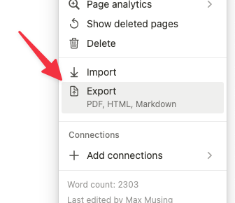

A raycast script command that will detect images in your markdown file, upload those images to S3, and replace the image links in the markdown file with links to S3. This was built for our use case of writing blog posts in Notion, downloading the blog posts as markdown, and converting the markdown to something we can use in Framer by having all the images hosted on S3.

This has only been tested with markdown exported from Notion.

### Usage

- Follow the instructions in the Raycast script-commands repository to install the script command: https://github.com/raycast/script-commands#install-script-commands-from-this-repository

- You'll need to modify some values in the `upload-markdown-images.sh` script file to get this working for you. There are variable values that are named `REPLACE_ME` that you'll need to replace with your own values. This will make sure that things like the S3 bucket name are correct for your use case.

- Export your markdown file from Notion and save it to your computer.

- Unzip the files that are exported from Notion, and copy the path of the markdown file. You can do this on Mac by right clicking on the file, holding down the option key, and clicking "Copy "FILENAME" as Pathname".

- Invoke the Raycast script command and paste in the path of the markdown file.

- After invoked, there should be a new markdown file in the same directory as the original markdown file. The new markdown file will have the image links replaced with links to the S3 bucket.
